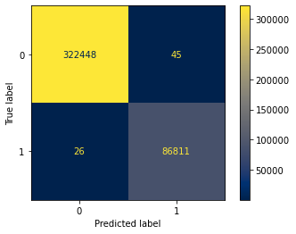

# cic-ids-2018-intrusion-detection-classification
__Operating System__: Ubuntu 18.04 (you may face issues importing the packages from the requirements.yml file if your OS differs).

Baseline experiments on training a Decision Tree Classifier and a Random Forest Classifier using Grid Search with Cross Validation on the CIC IDS 2018 dataset ([official website](https://www.unb.ca/cic/datasets/ids-2018.html)) [[1](#references)] for training Machine Learning network intrusion detection classifier models.

I downloaded the Processed Traffic Data for ML Algorithms CIC IDS 2018 dataset via ```aws s3 sync --no-sign-request --region <your-region> "s3://cse-cic-ids2018/Processed Traffic Data for ML Algorithms/" <your-dest-dir> ```. After exploring the data I decided to only use the "__Friday-02-03-2018_TrafficForML_CICFlowMeter.csv__" and "__Friday-16-02-2018_TrafficForML_CICFlowMeter.csv__" as the other files had extremely imbalanced labels which would require Anomaly Detection methods. The chosen files contained the following labels:
* Benign
* Bot
* DoS attacks-SlowHTTPTest
* DoS attacks-Hulk

The "Bot", "DoS attacks-SlowHTTPTest", and "DoS attacks-Hulk" labels were combined into one "Malicious" label. After removing some columns, missing values, and duplicate records the processed dataset "__processed_friday_dataset.csv__" ended up with 1,074,342 "__Benign__" records and 290,089 "__Malicious__" records. The dataset was later split into a 70/30 train/test split which a decision tree classifier and random forest classifier were trained using Grid Search with 5-fold Cross Validation.

### Model results on test set
#### 1- Decision Tree Classifier
* Accuracy: 99.982%
* Macro Average Precision: 99.969%
* Macro Average Recall: 99.978%
* Macro Average F1-Score: 99.974%



#### 2- Random Forest Classifier
* Accuracy: 99.904%
* Macro Average Precision: 99.787%
* Macro Average Recall: 99.926%
* Macro Average F1-Score: 99.856%


### Dataset
* CIC-IDS-2018 Processed Traffic Data for ML Algorithms on my Google Drive: [Drive](https://drive.google.com/file/d/1cJECqTj7ExPuwCddrCPB5RTnuk5NKvCF/view?usp=sharing)
* Processed Friday dataset "__processed_friday_dataset.csv__" that was used in the baseline experiments: [Drive](https://drive.google.com/file/d/1PaRrET5dDzJPFwGa7bUMmIwjQmE9otTb/view?usp=sharing)

### References
[1] Sharafaldin, Iman & Habibi Lashkari, Arash & Ghorbani, Ali. (2018). Toward Generating a New Intrusion Detection Dataset and Intrusion Traffic Characterization. 108-116. 10.5220/0006639801080116.

### Hardware Specifications
* i9-9900KF Intel CPU overclocked to 5 GHz.
* 32 Gigabytes DDR4 RAM at 3200 MHz.
